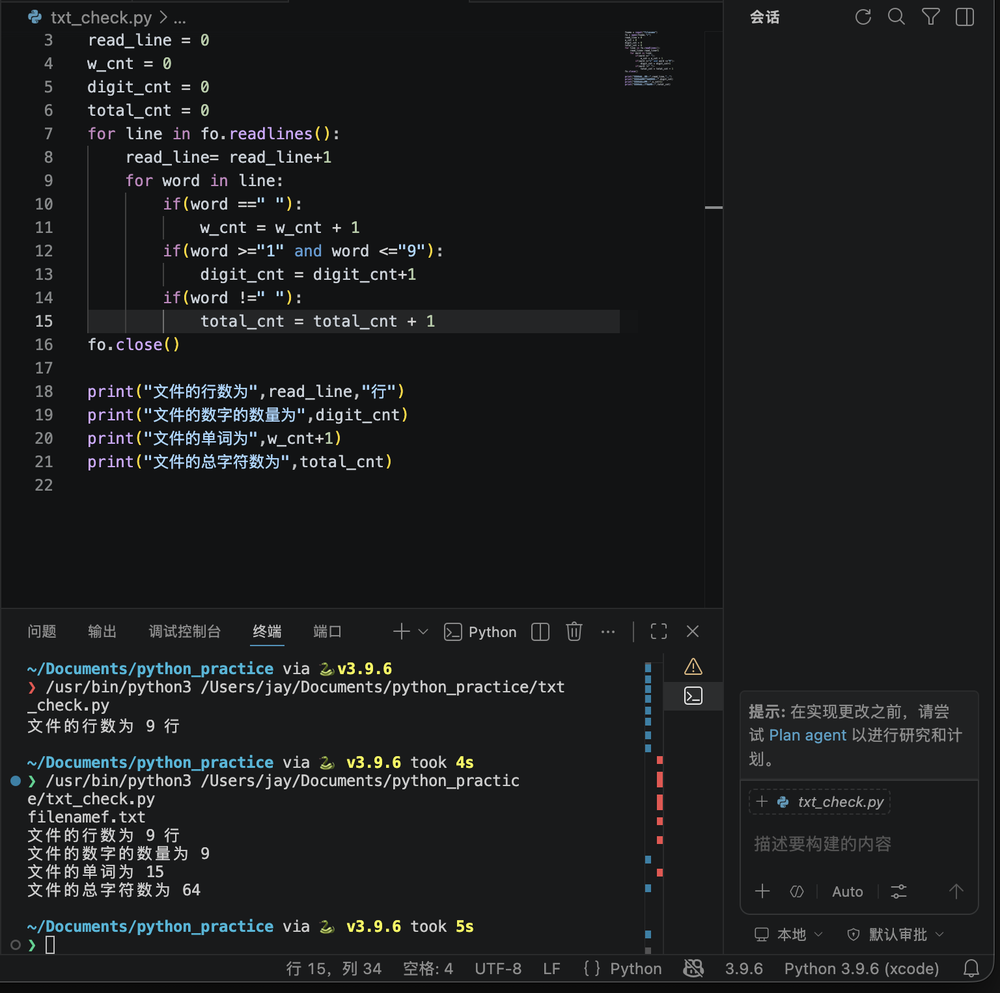

- 今天学习了python中的文件读取：
`open()` `.read()` `.readline()`
`close()`
知道了python中读取文本的基本格式

- 做了一个简单的打开文本文件判断字数、行数、数字数、总字符数的python程序,
- 
- 阅读了关于python中文本读写的章节

- 在vs code中创建了PYTHON_PRACTICE的文件夹,写下了这个练习txt_check.py
- 复习了数组和字符串的基础知识
- 学习了高等数学中的第一类曲面积分
### 明日计划
- 在mit missing semester中学习如何在Linux中进行程序运行、调试
- 复习哈希表相关知识，了解哈希表在python中与C++的差异
- 完成第二个词频的py文件并commit
- 学习pytest的基础概念
- 继续学习python基础知识

