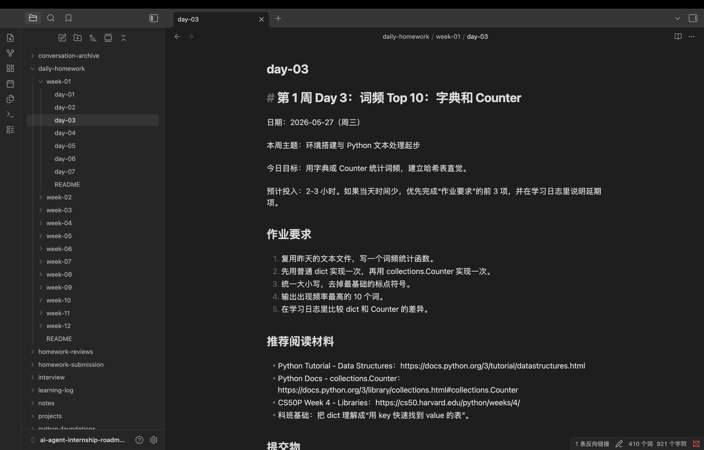

## 今日目标

- 修改昨日作业，将昨天批改建议修改
- 学习CS50P-Lecture4-Libraries的前半部分

## 今天做了什么

- 学习了python中`dict`的概念以及常见用法

## 产出证据

- 代码文件：word_frequency_count.py
- 测试结果：`['plum', 'write', 'swim', 'apple', 'run', 'read', 'wolf', 'fish', 'banana', 'grape']`
- 测试文本：01.txt

- Commit：
- 截图 / demo：
- 学习笔记：notes/2026-05-23 笔记：python数据结构基础
## 遇到的问题

- 不清楚如何将dict的key和value拆开，然后依据value的值排序
- 不清楚如何只截前十个值

## 如何解决

- 学习了`items()`语句，分开了dict的key和value，并使用lambda函数以及`sorted`方法将字典按照值从高到低的顺序排列
- 使用了`[:10]`控制列表长度为10

## 明天计划

- 按照明日的作业规划安排
