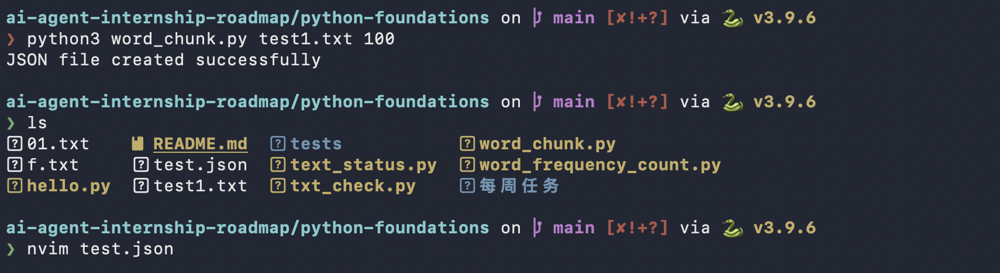
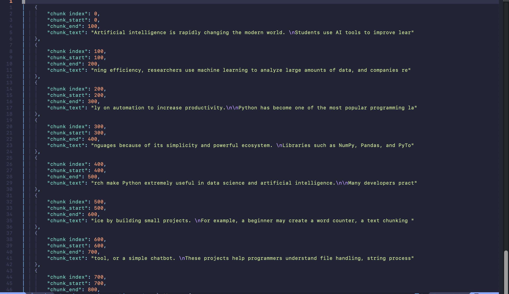

## 今日目标

- 完成文本分块功能
- 了解LLM app的基础组成
- 学习JSON的概念

## 今天做了什么

- 今天做了关于对于文本进行分块处理的一个小程序

## 产出证据
- 2026-05-24笔记
- 代码文件：word_chunk.py
- 测试结果：成功
- Commit：成功
- 截图 / demo：
- 
- 

## 遇到的问题

- 我不知道如何把python对象别成json格式的文件
- 不知道如何不用input语句传递文件名和其他参数
- 不知道如何从python中创建json格式的文件

## 如何解决

- 学习了`json.dump()`和`json.dumps()`语句
- 学习了`import sys`了解通过终端的传递值的方式
- 复习了`with open(filename,'w')`模式知道了可以直接新建文件

## 明天计划

- 明日继续学习chunk的模式，去尝试一下别的chunking方式，比如说按照段落chunking，按照单词chunking，按照语义chunking
- 明日学习如何在vscode中进行调试
- 明日继续按照每日学习计划进行学习

