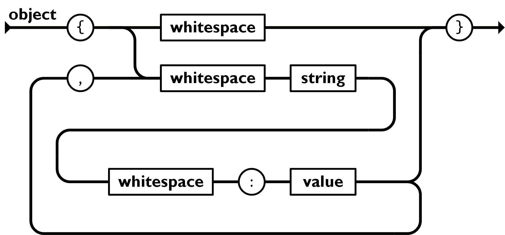
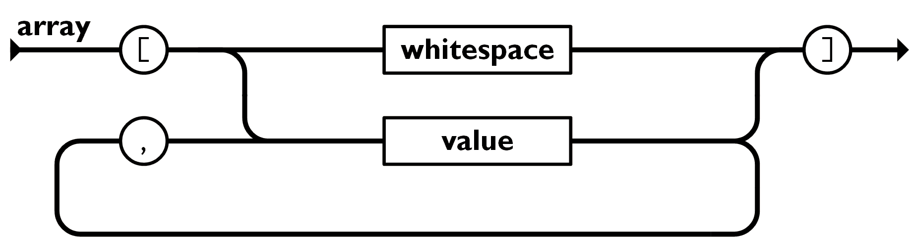

## 一句话解释
https://www.runoob.com/json/json-tutorial.html

用自己的话解释这个概念是什么。
JSON:Javascript Object Notation
JSON是一种轻量级的数据交换格式:用于在不同系统、程序、语言之间传递数据的一种统一格式

## 为什么重要


说明它和当前项目、AI Agent、RAG、后端工程或科班基础有什么关系。


## 概念及代码
### JSON 对象


JSON 对象在大括号 {} 中书写：

```python
{key1 : value1, key2 : value2, key3 : value3}
```
对象可以包含多个 **key/value（键/值）**对。

key 必须是字符串，value 可以是合法的 JSON 数据类型（字符串, 数字, 对象, 数组, 布尔值或 null）。

key 和 value 中使用冒号 : 分割。

每个 key/value 对使用逗号 , 分割。

访问对象: `.`号
## 嵌套 JSON 对象

JSON 对象中可以包含另外一个 JSON 对象：
```javascript
myObj = {
    "name":"runoob",
    "alexa":10000,
    "sites": {
        "site1":"www.runoob.com",
        "site2":"m.runoob.com",
        "site3":"c.runoob.com"
    }
}
```

## 删除对象属性

我们可以使用 **delete** 关键字来删除 JSON 对象的属性：
`delete myObj.sites.site1`
`delete myObj.sites["site1"]`
### JSON数组

JSON 数组在中括号 `[]` 中书写：
数组里可包含多个对象
```javascript
[
    { key1 : value1-1 , key2:value1-2 },
    { key1 : value2-1 , key2:value2-2 },
    { key1 : value3-1 , key2:value3-2 },
    ...
    { key1 : valueN-1 , key2:valueN-2 },
]
```


### JSON 使用 JavaScript 语法

因为 JSON 使用 JavaScript 语法，所以无需额外的软件就能处理 JavaScript 中的 JSON。

通过 JavaScript，您可以创建一个对象数组，并像这样进行赋值：
JSON 的特点：
```javascript
var sites = [
    { "name":"runoob" , "url":"www.runoob.com" },
    { "name":"google" , "url":"www.google.com" },
    { "name":"微博" , "url":"www.weibo.com" }
];


```


- 轻量
- 人类可读
- 机器容易解析
- 跨语言
###  Python JSON
#### JSON 函数
使用JSON函数需要导入json库：`import json`
函数`json.dumps`将python对象编码成JSON字符串
`json.loads`:将已编码的JSON字符串解码为python对象


#### `json.dumps`
语法：
```python
json.dumps(obj,skipkeys=False,ensure_ascii=True,check_circular=True,allow_nan=True,cls=None,indent=None,separators=None,encoding="utf-8",default=None,sort_keys=False,**kw)
```

具体参数
`indent=None`:控制缩进，等于几就是缩进几个空格
 `sort_keys=False`：是否按 key 排序。
 ## `separators=None`控制分隔符。
中文相关

`ensure_ascii=True`
这是 Python JSON 非常重要的一个坑。
实际开发都会写：`ensure_ascii=False`

 错误处理相关
`skipkeys=False`
JSON 的 key 必须是：

- str
- int
- float
- bool
- None

如果 key 是别的类型会报错。
`skipkeys=True`:会直接跳过非法的key

## 常见错误

-

## 我今天的理解


## 后续问题

-
